# BACKDOORCTF 2023


> Tản mạn: Giải này có vẻ là giải cuối mà team mình đánh trong năm 2023. Mọi người trong team dù vẫn trong thời gian học quân sự, tuy nhiên vẫn cố gắng thức đêm làm. Thành quả không cao tuy nhiên đó là cả sự nỗ lực team mình ( 58/787 ) . ~~Thọt pwn quá~~. Writeup này mình chỉ viết một số bài mới và thú vị nên nếu có thiếu sót xin mọi người thông cảm.


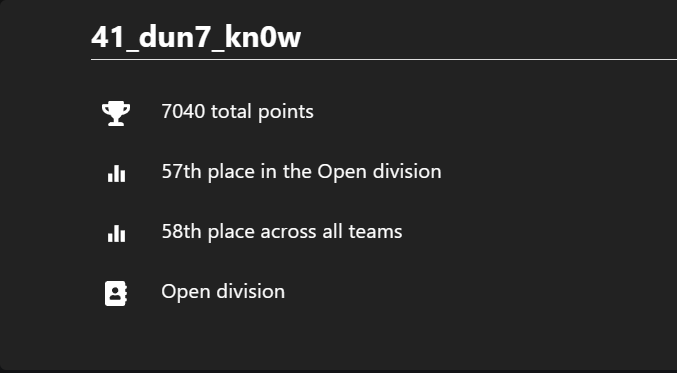


## REVERSING
### baby eEBF

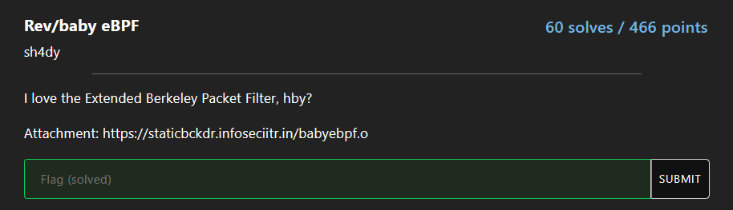

[chall](https://staticbckdr.infoseciitr.in/babyebpf.o)

#### Solution:

Bài này nếu intended way của author thì phải làm như sau

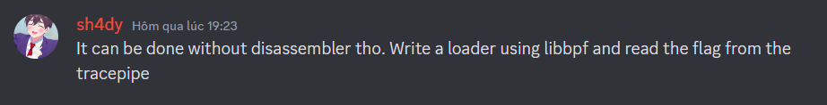

Tuy nhiên thì mình chưa biết cách này. Nên trong lúc làm decompile bằng IDA không được nên mình đi research cách decompile file này. Tình cờ mình tìm được ``https://github.com/Nalen98/eBPF-for-Ghidra`` 

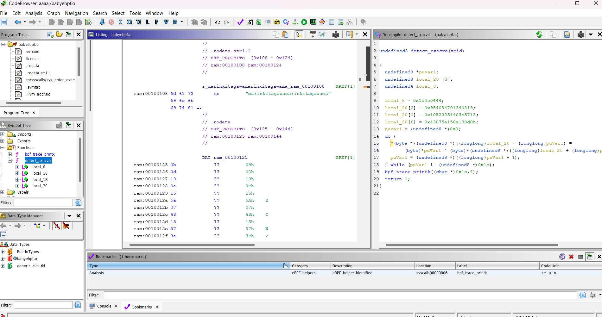

Đọc đoạn code bây giờ có vẻ rõ ràng hơn rồi. Tóm tắt thì nó xor từng kí tự của 2 mảng dài 28 kí tự. Đến lúc này mình nhận ra trong chương trình này có một chuỗi và một mảng cũng dài 28 kí tự. Ta thử xor và bingo flag cuming...

```python
str = b'marinkitagawamarinkitagawama'
arr = [11, 13, 19, 14, 21, 90, 7, 67, 19, 87, 62, 64, 81, 50, 82, 16, 25, 8, 52, 1, 71, 9, 84, 9, 68, 4, 5, 28]

for i in range(len(str)):
    print(chr(str[i] ^ arr[i]),end="")
```

**flag{1n7r0_70_3bpf_h3h3h3eh}**


### Sl4ydroid

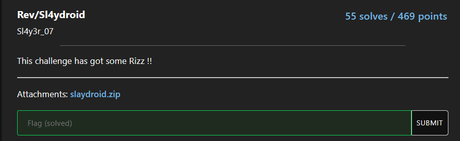


[chall](https://staticbckdr.infoseciitr.in/slaydroid.zip)

#### Solution:

Đây là một bài rev apk, bài này giúp mình biết thêm về **native libs**. Cài thử file apk này ta chỉ nhận được một màn hình như sau với không một chức năng nào hết

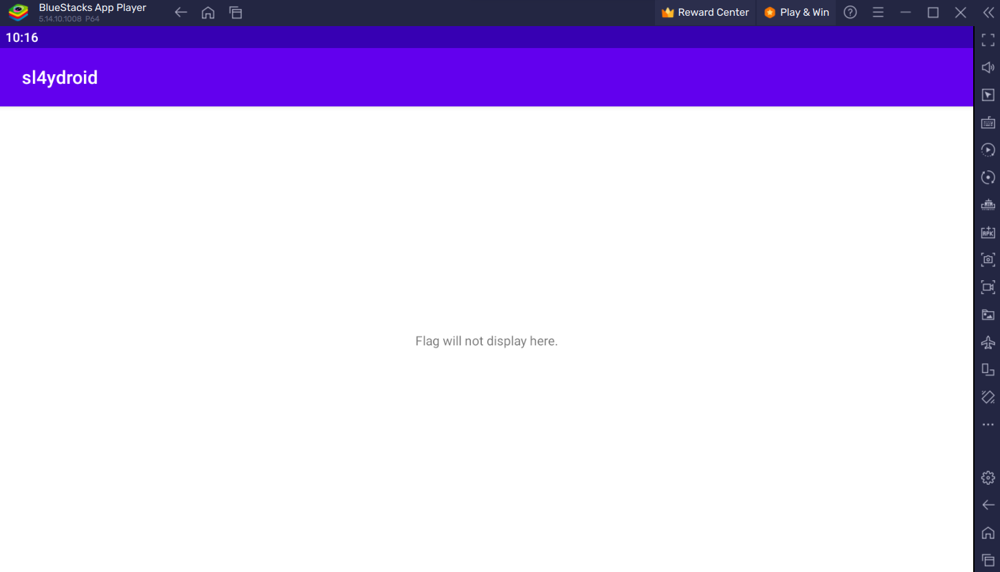

Decompile bằng JADX. Thì cơ bản khi chương trình nó chỉ xuất dòng ``Flag will not display here`` tuy nhiên còn các hàm chạy ẩn trong đấy.

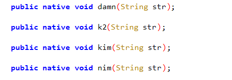

Nó gọi các hàm theo thứ tự sau và truyền vào các chuỗi

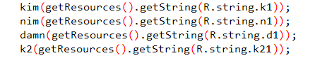

```
kim = "Yc^XtMfu"
nim = "0,S[)"
damn = "~?z?^S8o"
k2 = "xP78V`m?3XeL"
```

Lúc đầu khi làm tới đây mình không biết phải làm gì vì cơ bản hàm nó trống không. Sau khi research thì mình biết rằng là native methods : ``Simply put, this is a non-access modifier that is used to access methods implemented in a language other than Java like C/C++.``. Vậy thì hàm này sử dụng một chương trình khác code bằng C/C++. Ta liền vào folder libs và mở file .so để reverse.

Oke load bằng ida xong thường thì thói quen mình xem các chuỗi có liên quan tới bài không và bài này cũng không ngoại lệ ta thấy được các string liên quan tới tên hàm được gọi trong file apk

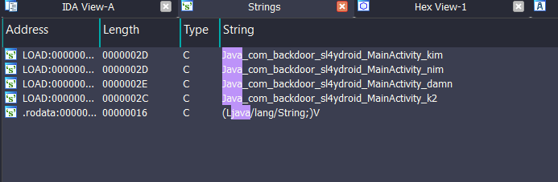

Việc tiếp theo là reverse từng hàm thôi bắt đầu với hàm ``kim``. Đọc sơ qua thì mình thấy khúc quan trọng nhất là ở đây

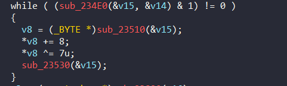

Hàm **sub_23510** có nhiệm vụ nhận input và sau đó từng kí tự +8 và xor cho 7. Vậy thì ta chỉ cần viết script của các kí tự chuỗi **kim**. 

Tiếp theo là hàm ``nim``.

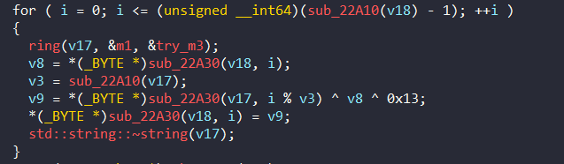

**v8** lúc này sẽ là thứ nhận input của ta nhưng khác với hàm ``kim`` nó còn có mảng **v17**. Vậy tìm mảng array đâu để xor với từng kí tự của input và xor 0x13 ?. Lúc này ta quay lại với hàm ``ring(v17, &m1, &tryme)``. Trước tiên ta cần biết m1 và tryme là gì. 

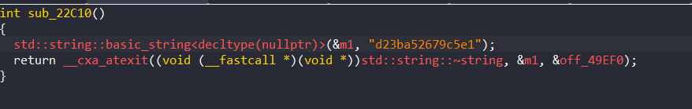

Vậy thì **m1** sẽ là chuỗi ``d23ba52679c5e1`` ( chuỗi hex )

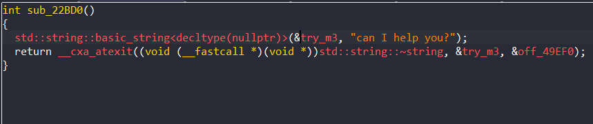

Chuỗi **tryme** là ``can I help you?``. Tới đây thì mình khá chắc nó là một dạng mã hóa nào đó m1 sẽ là input và tryme là key. Tuy nhiên vào đọc kĩ ring để biết rõ

```C=
__int64 __fastcall ring(__int64 a1, __int64 a2, __int64 a3)
{
  unsigned __int64 v3; // rax
  __int64 v4; // rax
  int v5; // eax
  __int64 v6; // rax
  int v7; // eax
  __int64 v9; // [rsp+10h] [rbp-F0h]
  int v10; // [rsp+1Ch] [rbp-E4h]
  int v11; // [rsp+44h] [rbp-BCh]
  __int64 v12; // [rsp+48h] [rbp-B8h]
  int v13; // [rsp+68h] [rbp-98h]
  char v14; // [rsp+6Fh] [rbp-91h]
  int j; // [rsp+7Ch] [rbp-84h]
  int i; // [rsp+80h] [rbp-80h]
  int v17; // [rsp+84h] [rbp-7Ch]
  int v18; // [rsp+84h] [rbp-7Ch]
  signed int v19; // [rsp+88h] [rbp-78h]
  __int64 v21; // [rsp+B8h] [rbp-48h] BYREF
  __int64 v22; // [rsp+C0h] [rbp-40h] BYREF
  char v23[24]; // [rsp+C8h] [rbp-38h] BYREF
  char v24[24]; // [rsp+E0h] [rbp-20h] BYREF
  unsigned __int64 v25; // [rsp+F8h] [rbp-8h]

  v25 = __readfsqword(0x28u);
  sub_22DC0();
  zamn(v24, a2);
  std::vector<int>::vector(v23, 256LL);
  v17 = 0;
  for ( i = 0; i < 256; ++i )
    *(_DWORD *)sub_23350(v23, i) = i;
  for ( j = 0; j < 256; ++j )
  {
    v11 = *(_DWORD *)sub_23350(v23, j) + v17;
    v3 = sub_22A10(a3);
    v17 = (*(char *)sub_23370(a3, j % v3) + v11) % 256;
    v12 = sub_23350(v23, j);
    v4 = sub_23350(v23, v17);
    sub_233A0(v12, v4);
  }
  v19 = 0;
  v18 = 0;
  v22 = sub_23410(v24);
  v21 = sub_23470(v24);
  while ( (sub_234E0(&v22, &v21) & 1) != 0 )
  {
    v14 = *(_BYTE *)sub_23510(&v22);
    v5 = v19 + 1;
    if ( v19 + 1 < 0 )
      v5 = v19 + 256;
    v19 = v19 - (v5 & 0xFFFFFF00) + 1;
    v18 = (*(_DWORD *)sub_23350(v23, v19) + v18) % 256;
    v9 = sub_23350(v23, v19);
    v6 = sub_23350(v23, v18);
    sub_233A0(v9, v6);
    v10 = *(_DWORD *)sub_23350(v23, v19);
    v7 = *(_DWORD *)sub_23350(v23, v18) + v10;
    v13 = *(_DWORD *)sub_23350(v23, v7 % 256);
    sub_22EA0(a1, (unsigned int)(char)(v13 ^ v14));
    sub_23530(&v22);
  }
  sub_23550(v23);
  std::string::~string(v24);
  return a1;
}
```

Không nghi ngờ gì nữa đây là RC4. Có input có key thì ta tìm được ngay mảng v17 là ``yeahh!!``

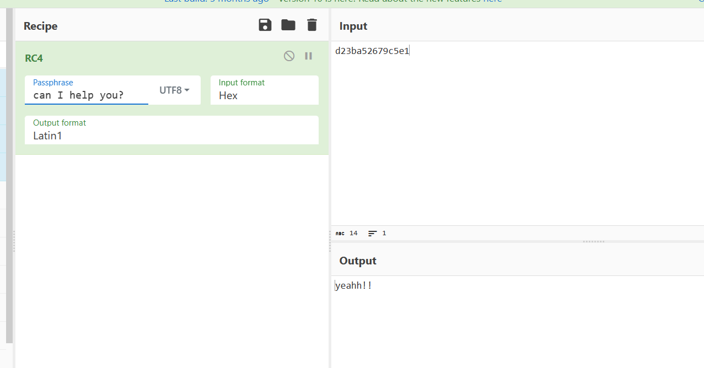


Tiếp theo là hàm **nim** hàm này thì dễ hơn nó chỉ lấy input xor với 0xC tuy nhiên nó làm ngược lại nên lúc xor xong ta phải lấy chuỗi ngược lại

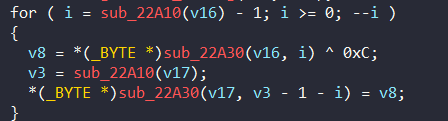

Hàm cuối là **k2** thuật toán lúc này chỉ là lấy từng kí tự mảng **v2** xor với input mà **v2** là ``May_1??``

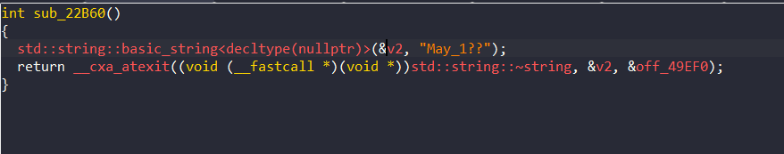

Oke vậy thì script cuối cùng của mình để giải bài này là.
```python
kim = "Yc^XtMfu"
nim = "0,S[)"
damn = "~?z?^S8o"
k2 = "xP78V`m?3XeL"
rc4= "yeahh!!"
v2 = "May_1??"

for i in range(len(kim)):
    tmp = ord(kim[i]) + 8
    tmp = tmp ^ 7
    print(chr(tmp),end="")

for i in range(len(nim)):
    print(chr(ord(rc4[i]) ^ ord(nim[i]) ^ 0x13), end= "")

for i in range(len(damn)-1, -1, -1):
    print(chr(ord(damn[i]) ^ 0xc), end = "")

for i in range(len(k2)):
    print(chr(ord(v2[i%len(v2)]) ^ ord(k2[i])),end="")
```

**flag{RizZZ! Rc4_R3v3r51Ngg_RrR!:}**
